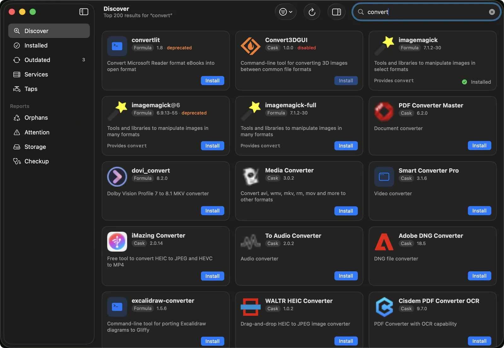

# Brewery

A Mac app for Homebrew. Search for packages, install and update them, run
services and manage taps, without opening a terminal.



Native macOS app, built with SwiftUI. No third-party dependencies.

## Requirements

macOS 26 or later, and [Homebrew](https://brew.sh).

## Building

There is no signed download yet, so you build it yourself. You need Xcode.

```sh
make install    # Release build into /Applications
make run        # Debug build, then launch
make test       # unit tests, headless
make test-ui    # UI tests; needs automation permission
```

`ARCHITECTURE.md` is the spec.

## License

MIT, see [LICENSE](LICENSE).

## Disclaimer

This app was 100% vibe-coded.
But I use it daily and it works well enough for me.
